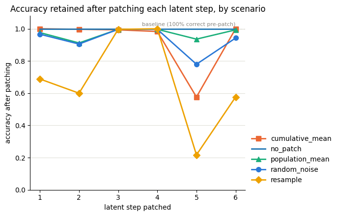
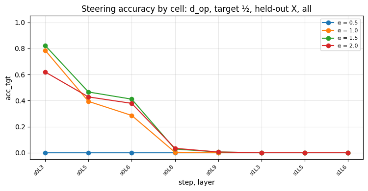
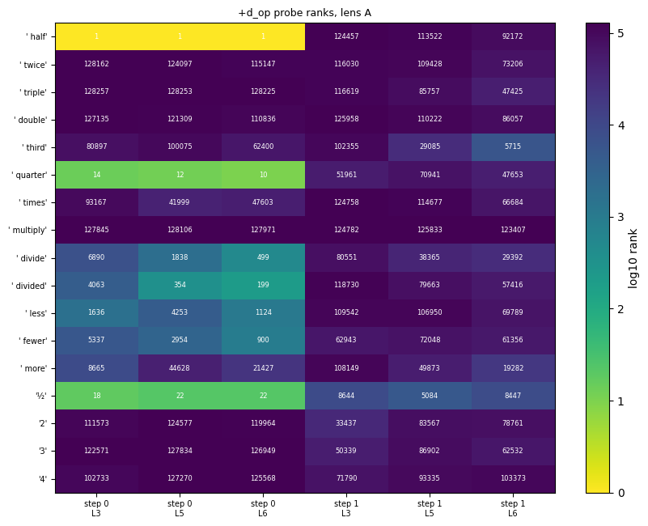

## Introduction

As the AI models get better at long horizon tasks, we see people trusting the LLMs with long range tasks and permissions across the board. These often include permissions for destructive tasks as well and the outcome hasn’t always been smooth. In December 2025, AWS Cost Explorer experienced a 13 hour outage due to the internal AI tool kiro having broad permissions. It decided the effective way to solve the task at hand was to remove the environment and build it from scratch. The recent Open AI’s model’s attack on hugging face underscores it too. This begs the question of liability. How can we use these tools effectively if we can’t understand the reasoning behind the actions in a short time. There is an impetus to understand the reasoning behind these models. Could we monitor their reasoning and catch/prevent such events? With LLMs increasingly moving their reasoning from chain of thought to latent space, can we identify the reasoning behind their actions/answers? 

## Tldr; Findings

As part of BlueDot impact’s 30 hour research sprint, I focused on how does the CODI model interpret mathematical questions? I used a Llama-3.2-1B-Instruct CODI model that was publicly available and performed some causal tracing experiments.

1. Latent vectors contain causal information for 3-step prompts but on 2-step prompts, CODI model do not need the latent steps. Since replacing the latent vectors on these tasks is able to drop the accuracy.   
2. However, steering the direction on latent steps doesn’t steer the answer  but applying direction steering in the very first pass between L3- L6 of 16 layers, did cause the answer to change.  
3. Token directions rank "half" in top k in the lenses but didn’t provide any result during steering.  
4. The steering directions encode more information than just a token and it’s difficult to construct the steering direction from scratch if you don’t know the target directions.

## Glossary

1. Logit lens \- Standard logit lens library decodes the model’s intermediate hidden state as if it were the final one by passing the residual directly through the model’s final norm and unembedding layer and take the top k tokens.  
2. Jlens \- As I understand, Jlens is the learned direction to logit lens. For each source layer, it calculates the backpropagates the gradient of the output with respect to the residual at that layer i.e. E\[∂h\_L/∂h\_l\], the Jacobian of the final hidden state with respect to h\_l, averaged over a set of fit prompts. How does a change in the residual impact the change in output.   
3. Jspace \- J-space is the space of token directions a J-lens defines at a given layer, and a J-space decomposition expresses a hidden state as a sparse mix of those directions. 

## Inspiration

This began as a way to replicate the alignment paper on [Interpreting latent Reasoning in CODI model using Logit lens](https://www.alignmentforum.org/posts/YGAimivLxycZcqRFR/can-we-interpret-latent-reasoning-using-current-mechanistic) . I was able to extend it to use Jlens instead of standard logit lens. I also intended to extend the reasoning experiments to the HRPO model but I couldn’t find a publicly available trained checkpoint and the training the model from scratch couldn’t be completed within the 30 hour research sprint. However, that is something I am curious to check.

## Model

I used a Llama-3.2-1B-Instruct CODI model since I could find a trained checkpoint available publicly on HuggingFace. The CODI model is trained to think in latent space through a student \- teacher distillation. The teacher is trained to use Chain of Thought while the student learns to think in latent space using the teacher’s chain of thought. The model uses a fixed number of steps as “thinking” steps where the model simply iteratively processes the residual from these latent steps. It uses special padding tokens to mark the beginning  and end of thought process. At the end of which, it gives the answer. I used 6 latent steps as the original CODI paper used the same value.

## Interpretability methodology

I fit a Jlens to the model’s 8 of the 16 intermediate layers using the wiki text prompts associated with the Jlens library provided by Anthropic and the mathematical prompt templates I was using for the test. The fitting also utilized the latent steps i.e. the backpropagation included over the 6 latent steps and not just a single forward pass.

For the prompt: **Natalia sold clips to 77 of her friends in April, and then she sold thrice as many clips in May. How many clips did Natalia sell altogether in April and May?**

\--- Top-10 tokens per (layer, step)  as per Jlens---

|  | step 0 | step 1 | step 2 | step 3 | step 4 | step 5 | step 6 |
| :---: | ----- | ----- | ----- | ----- | ----- | ----- | ----- |
| **L3** | \[ plus, "+", Plus, Plus, suddenly, cers, compound, configured, conditions, cé\] | \[ otherwise, 1, 8, interchange, otherwise, presses, 2, thức, 9, �\] | \[�, ranges, range, aries, ô, map, Range, ath, maps, �\] | \[ fifty, thirty, u, twenty, �, forty, fir, Tel, practical, existing\] | \[eten, ază, gren, 72, rolled, plainly, given, วง, モン, führ\] | \[23, 2, 10, �, 20, 80, 1, �, its, 91\] | \[1, 9, 2, ship, 8, 5, �, 4, 7, 0\] |
| **L5** | \[ "+", cers, (", compound, cé, plus, suddenly, conditions, original, compound\] | \[8, otherwise, 1, ipsis, presses, loth, ranges, otherwise, appar, press\] | \[ ranges, �, range, Range, map, aries, maps, ues, Mines, ô\] | \[�, گی, Hy, u, cl, chemes, plib, fir, Tel, fifty\] | \[given, eten, ekten, 72, モン, วง, ază, generated, rolled, aded\] | \[23, 2, 10, �, 20, �, \-fi, its, 9, 8\] | \[9, 1, ship, 8, 0, 5, 4, 7, 2, �\] |
| **L6** | \[\\n, Compound, compound, Compound, \\n\\n, compound,  \\n\\n, řet, pickup, .cgi\] | \[8, 1, 2, loth, \-not, instead, ipsis, thức, 9, otherwise\] | \[ ranges, �, range, aries, Range, ô, map, Mines, ies, hir\] | \[�, u, گی, others, うち, Aviv, Hy, known, ihar, Tel\] | \[ekten, eten, given, ază, expansions, วง, rolled, 72, モン, eq\] | \[2, 23, \-fi, 10, �, 20, �, certainly, 9, vertiser\] | \[9, 0, 8, 1, 5, ship, 2, 4, 7, zen\] |
| **L8** | \[ Plus, .No, poorer, eten, UCH, \+\\n\\n, Let, ently, teamed, 편\] | \[instead, 8, iveness, \+len, uien, lio, \-Key, 9, kits, eight\] | \[most, vis, 0, mine, men, ô, lass, subject, operator, istry\] | \[ under, onz, mare, ihar, ir, un, fir, hy, unist, Hy\] | \[ekten, congest, davon, zaw, edly, 紫, ję, subsystem, eq, flat\] | \[mare, 23, 0, áž, 9, 付, ewart, 2, 8, �\] | \[9, 0, 4, 8, 5, 7, robe, dale, road, 6\] |
| **L9** | \[ Including, Plus, including, Plus, plus, Including, namely, including, davon, oneself\] | \[8, 9, instead, eight, \+len, jazy, /en, intents, 6, anness\] | \[0, ô, 9, subject, down, compliance, lass, out, ians, vis\] | \[ arr, asar, practical, elder, maf, insurers, jah, insurer, aland, mare\] | \[ zaw, edly, ekten, given, congest, League, çu, วง, 射, ulpt\] | \[mare, 23, 9, 0, 8, 4, 2, 5, 丘, áž\] | \[0, 9, 8, 4, 5, 7, ship, 1, dale, ợ\] |
| **L11** | \[\*, multiplied, mul, Multiply, Mul, \*, Mul, multic, ối, Times\] | \[ affiliates, ips, asser, \-Key, ail, Insecta, airs, ailles, couples, intersects\] | \[istry, ies, ical, 0, ô, rid, mon, men, 9, äß\] | \[uir, indeed, ają, specifically, rud, ąż, on, mare, simply, ère\] | \[Cri, chers, colleg, given, verw, flatten, aws, gió, vez, \-master\] | \[23, mare, 9, ship, lar, rzy, 2, rid, ews, wij\] | \[9, 0, 8, ship, 7, 4, 1, 5, ợ, rid\] |
| **L12** | \[\*, \*, mul, {\*, \*:, Mul, multi, Mul, :, "\*\] | \[ affiliates, Hundreds, hundreds, CHAIN, Mul, lius, iov, lant, exceeds, thousands\] | \[min, ies, lass, ournal, istry, ents, awn, men, ais, ical\] | \[ by, um, mar, �, flat, uo, uos, absolutely, aff, mar\] | \[vez, flat, flatten, Flat, 交通, Flat, flat, ekten, aws, given\] | \[23, 213, mare, 231, bars, 9, awl, awks, wij, ssel\] | \[9, 7, 1, 8, 3, 4, 2, 0, 5, ship\] |
| **L14** | \[Times, moll, {\*, QQ, viz, \*, mun, Times, qq, times\] | \[�, Shine, aws, аж, nn, ww, QQ, Alle, ies, xxx\] | \[awn, val, vin, map, aff, aws, mum, nn, s, ww\] | \[\>\>, \>, \=, ,, aud, ust, approx, kit, ipro, \>\>\] | \[ww, WW, wis, ww, visions, mann, qq, ews, ний, QQ\] | \[wis, val, 231, wik, wi, ww, ww, vein, 207, 209\] | \[\>\>, val, ", ship, un, v, \>, s, \\), diss\] |
| **final (model)** | \[\*, 231, :, times, Times, Times, times, 237, TIMES, volte\] | \[231, 191, 237, VIN, val, ví, 221, \-, vein, \*\] | \[", \>\>, 191, val, \>, vu, vin, v, \*, ,\] | \[\>\>, \>, ,, that, \=, ust, by, ", is, s\] | \[231, 237, \*, 221, 247, 233, 229, ww, 227, 239\] | \[231, \-, \*, val, 237, 221, 233, 191, vibrations, VIN\] | \[\>\>, \>, ", \=, \*\*, ,, \\), "\>, ât, s\] |

You can see the token “multiply” and the intermediate value “231” appear on in the intermediate steps. However this is just correlation. In order to decide if this is causal, I performed the following experiments.

### Experiment setup

I ran the following experiments to determine causality.

1. Activation Patching  
   1. I used the following prompt template and ran about 300 questions through the below mentioned tests. "A team starts with {X} members. They recruit {Y} new members. Then each current member recruits {Z} additional people. How many people are there now on the team? Give the answer only and nothing else."  
   2. Swapping out residuals from other examples at a particular step and layer did cause the answer to change. Residuals on each latent step were replaced according to the following. Breaking steps 1, 2, 5 and 6 drops accuracy by a lot.  
      1. Noise \- This section swapped out the residuals with random gaussian noise.  
      2. Resample from another questions latent step.  
      3. Cumulative mean \- cumulative mean over examples at that  step for each example.  
      4. Mean \-  Average of the residuals at the step over all examples for each example.

   

2. Counterfactual Testing  
   1. To the above template, I added additional random texts to each example: “ Then half of the team left”, “The whole team got dissolved”. Unfortunately the model was not able to perform this task accurately at its baseline. The model totally ignored “The whole team got dissolved” information and simply gave the previous output as answer and for “ Then half of the team left”, it gave incorrect answers.   
   2. This could be due to the model was overfit on GSM8K and most of the training information had a 3 step calculation. So adding 4th step could be making it to fail. However, I didn’t get time to test this in the 30 hour sprint.  
3. Direction steering  
   1. I used 4 similar templates:   
      1. **Natalia sold clips to {X} of her friends in April, and then she sold {W} as many clips in May. How many clips did Natalia sell altogether in April and May?**  
      2. **Tom read {X} pages on Monday, and then he read {W} as many pages on Tuesday. How many pages did Tom read altogether on Monday and Tuesday?**  
      3. **A farm had {X} cows in spring, and then it had {W} as many cows in summer. How many cows did the farm have altogether in spring and summer?**  
      4. **Sara baked {X} cookies on Saturday, and then she baked {W} as many cookies on Sunday. How many cookies did Sara bake altogether on Saturday and Sunday?"**  
         where W could be twice / triple / double / two / three / four times which would be steered towards half / one half / a third,   
   2. I took the vectors that represent the differences in residuals between the prompts varying in Y and X. Running PCA on these difference vectors revealed that the vectors majorly lie on the mean direction (d\_op) and the principal components encode other information such as the multiplier word used “twice, triple, double, two times, three times, four times” or the change pair i.e. “twice \-\> half, triple \-\> half” etc.  
   3. I used the mean difference vector of all examples (d\_op), mean difference vector for a single word pair (di) and weighted sum of "half"-named J-space atoms in d\_op's decomposition using: `new_residual = old_residual + α·‖dᵢ‖·d̂_op`, with α ∈ {0.5, 1, 1.5, 2}.  
   4. Only the  d\_op vector steering flipped the answer 99% of the time with the multiplying\_factor between 1 to 1.5. It works best at L3 and fades by L6 in the prompt pass. The steering in the latent steps didn’t help in flipping the answer. Acc\_tgt is the accuracy measure, its 1 if the answer is equal to the expected target, 0 otherwise.    
   5. I used a modified version of the template with more intermediate steps to steer direction in latent step. Although the token probability moved up, the answer did not change: **Natalia sold clips to {X} of her friends in April. In May she sold {Z} more clips than in April. In June she sold {W} as many clips as in April and May combined. How many clips did Natalia sell altogether in April, May and June?**  
4. Jlens on the d\_op vector   
   1. The top tokens in d\_op are displayed on the graph. The graph plots the log 10 of the rank. The rank is where a probe token lands when all \~128k vocabulary tokens are sorted by how much the direction raises their logit. Rank 1 i.e. log 0 \= 0, d\_op raises this token more than any other. " half" is rank 1 at L3/L5/L6.  
   2.   
      

## Future work

* Find further directional levers to change.  
* Repeat the experiments on logical questionnaire dataset  
* Extend the experiment to the newer HRPO models.

## References

* [CODI: Compressing Chain-of-Thought into Continuous Space via Self-Distillation](https://arxiv.org/abs/2502.21074)  
* [https://www.alignmentforum.org/posts/YGAimivLxycZcqRFR/can-we-interpret-latent-reasoning-using-current-mechanistic](https://www.alignmentforum.org/posts/YGAimivLxycZcqRFR/can-we-interpret-latent-reasoning-using-current-mechanistic)  
* [https://www.alignmentforum.org/posts/AcKRB8wDpdaN6v6ru/interpreting-gpt-the-logit-lens](https://www.alignmentforum.org/posts/AcKRB8wDpdaN6v6ru/interpreting-gpt-the-logit-lens)  
* [https://www.anthropic.com/research/global-workspace](https://www.anthropic.com/research/global-workspace)
